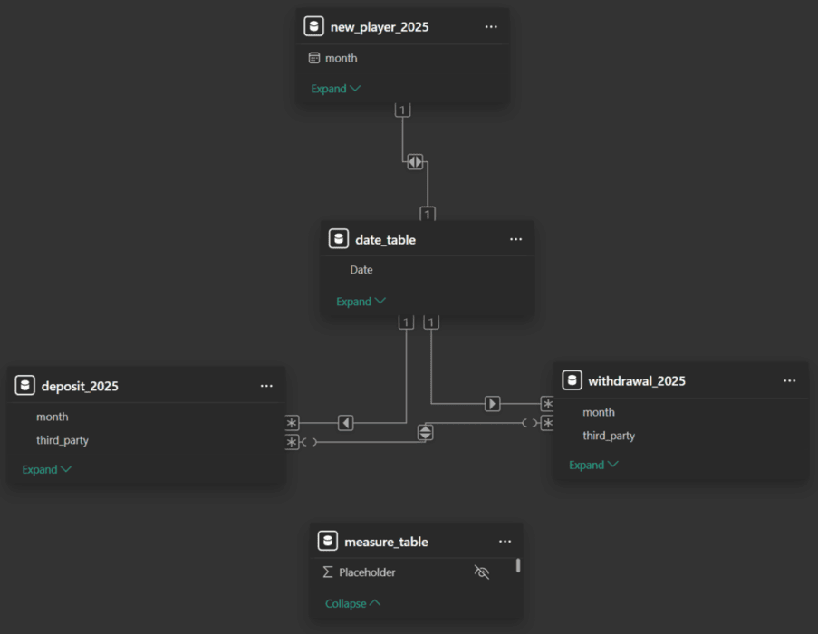

# **Fantasy Sports Payment Channel Insights – Project Overview**

A fantasy sports platform, established in 2023, targeting the **Indian market**, where users join **paid contests daily**. The platform processes **frequent deposits and withdrawals** through third-party payment providers.

This dashboard has been in use since 2023 to evaluate the performance of payment channels for deposits and withdrawals.

It is actively used in **monthly internal performance review meetings** with the Platform Owner, Operations Manager, Finance Lead, Promotion Coordinator, and Payment Channel Coordinator to support strategic decisions and performance improvements.

The version presented here showcases the 2025 reporting and analysis, with the goal of **improving financial infrastructure reliability** and **optimizing channel usage**.

> **Disclaimer**: All payment channel names in this dataset have been anonymized to protect privacy and confidentiality, following data handling practices aligned with standards such as PCI DSS and ISO 27001

**Insights and recommendations are provided across the following key areas**:
- **Deposit & Withdrawal Trend Overview**: Evaluation of monthly trends in total deposits, withdrawals, and new depositing users.  
- **Main Withdrawal Channel**: Assessment of withdrawal volume and **median processing time** of the main channel.  
- **Main Deposit Channel**: Performance comparison of **main deposit channels by volume and success rate**.  
- **Best Performing Deposit Channels**: Highlighting **qualified deposit channels** based on volume and a ≥ 50% success rate, along with **transaction fee benchmarking**.

🔗 **Resources**  
👉 [**Interactive Power BI Dashboard** – Viewable Online *(no download required)*](https://app.powerbi.com/view?r=eyJrIjoiZDc0ZjU3MDYtODBjOC00MWU4LTlhNzEtMmMwOGU2MmY5N2M4IiwidCI6IjFjNWQyOWRjLTgzMDItNGE3YS04ODU4LTY1NzM5ZGY2ZWQyMyIsImMiOjEwfQ%3D%3D)  
📄 [*SQL Query – Deposit Transactions*](./sql/monthly_deposit_kpi.sql)    
📄 [*SQL Query – Withdrawal Transactions*](./sql/monthly_withdrawal_kpi.sql)  
📄 [*SQL Query – New User Deposits*](./sql/monthly_new_user_deposit.sql)

---

# **Data Structure**

The data used in this project consists of three main tables:  
- `online_recharge_2025_xx`  
- `withdrawal_2025_xx`  
- `online_recharge_third_party`  

Table online_recharge contains monthly deposit transaction data, withdrawal_2025 contains monthly withdrawal transaction data, and online_recharge_third_party contains information about deposit payment channel data. Each month, these tables collectively contain approximately **3 to 5 million rows**.

*The diagram below illustrates the data structure and relationships. The withdrawal table is included for Power BI dashboard analysis but has no direct relationship with third-party providers*

  

*The screenshot below shows the Power BI semantic model, which is built on top of the raw SQL queries. It helps organize the information so it's easier to track monthly performance, success rates, and processing times.*

  

---

# **Executive Summary**

In **February 2025**, the platform's total deposit volume **declined by 11%**, while the number of new users depositing **increased by 12%**.  
Key performance indicators identified the main issue in **withdrawal processing times**, with a **median of 222 minutes** across all payment channels, more than double our acceptable range of 50–100 minutes.

The decline continued into **March**, where **deposit and withdrawal volumes nearly converged**, before rebounding in **April 2025**.  
The analysis focuses on **key areas** that impact both **operational efficiency** and **user experience**.

To evaluate monthly performance, we track three **core KPIs**:  
- **Total Deposit**  
- **Total Withdrawal**  
- **Total New Users Depositing**  

These reflect **business growth** and **platform engagement**.  

Additionally, we monitor two key **operational metrics**:
- **Deposit Channel Success Rate**  
- **Withdrawal Processing Time**

These metrics directly affect **user experience**. While strong performance in these areas may not always guarantee growth, **poor results will lead to sharp declines** in both deposit volume and user acquisition.  

👉 *Below is the main Dashboard page*  
This is an [**interactive Power BI Dashboard** – Viewable Online *(no download required)*](https://app.powerbi.com/view?r=eyJrIjoiZDc0ZjU3MDYtODBjOC00MWU4LTlhNzEtMmMwOGU2MmY5N2M4IiwidCI6IjFjNWQyOWRjLTgzMDItNGE3YS04ODU4LTY1NzM5ZGY2ZWQyMyIsImMiOjEwfQ%3D%3D)

---

# **Insight Deep Dive**

## **Deposit & Withdrawal Trend Overview**
- Deposits dropped from **₹433M in January** to a low of **₹340M in March** before rebounding slightly in April.  
- Withdrawals remained more stable but nearly converged with deposits in March (**₹331M vs ₹340M**), signaling a **drop in user trust** or **hesitation to deposit more**.  
- Although deposits rebounded in April, the number of **new users depositing continued to decline**, from **83K in February to 55K in April**.  

## **Main Withdrawal Channel**
- In February, **CDpay maintained its position** as the leading withdrawal channel, handling the **highest withdrawal amount** with a **median processing time of only 26 minutes**.  
- In contrast, the other four major channels (**Cubepay, Melonpay, YVEpay, JOIpay**) showed significantly **slower processing times**, ranging from **241 to 683 minutes**.  
- The performance gap shows **instability in February’s withdrawal channels** and sends a strong signal to **follow up with the third-party providers for improvement**.  

## **Main Deposit Channel**

> **Note**: Deposit channels are grouped into four capacity categories: **All, Large, Medium, and Small**, based on each third-party provider's ability to handle different transaction volumes. In this section, we focus on **All Transaction Sizes** as it is the primary focus for performance monitoring.

- In March, **Melonpay had the highest total deposit volume** but only achieved a **49% success rate**, falling short of the **50% benchmark**.  
- Out of the five main payment channels used, only **CDpay and BBpay** achieved success rates above 50% (**55% and 52% respectively**).  
- **BBpay was first tested in February**. In March, it showed consistency by maintaining a **success rate above 50%**.  

---

# **Recommendations & Key Achievements**

This project analyzed both **deposit and withdrawal channel performance**.  

However, actionable decisions are **focused on deposit channels**, where we control provider selection and deposit distribution.

As explained in the Insight Deep Dive, deposit providers are grouped based on their **transaction size capabilities**. We actively use **five main providers per category**, while others serve as **substitutes** or are tested through **short A/B experiments**, either as **backups** or **potential replacements** if they perform better in terms of **success rate** and offer **lower transaction fees**.

**Withdrawal channels**, on the other hand, are **not categorized**. We typically use the same providers selected as **main deposit channels** for that month, based on the **All Transaction Sizes group**. Since all providers charge a **flat transaction fee**, our focus is solely on **processing time**. As such, we have **limited control** and can only **escalate issues** when needed, as done during the **February delays**. Despite this limitation, we used **data-driven monitoring** to detect **processing delays** and escalated the issue to the **third-party provider**, resulting in **improved performance over time**.

---

This section highlights key decisions from **February–April** and outlines **next steps for May 2025**:

- **Rebuild user trust and acquisition momentum post-February**  
  Following severe withdrawal delays in February, **player trust declined significantly**, leading to a drop in both **deposit volume** and **new user activity**.  
  To retain our existing user base, we launched an **apology and compensation bonus campaign** via **telemarketing**, which received **More Than 80% positive response rate** from contacted users, based on **call feedback** and **bonus delivery**, and succesfully **retained over 60% of our existing user base**.
  This was followed by an **acquisition campaign** in partnership with an **influencer**, launched in **March** to reaccelerate **user growth** and support overall **deposit volume recovery**.  
  We are actively monitoring the **registration-to-deposit conversion funnel** to sustain recovery efforts going forward.

- **Maximize BBpay Deposit Channel utilization**  
  After promising test results conducted in **February**, we focused on **BBpay** in March.  
  The provider showed **consistent improvement**, reaching a **52% success rate in March (₹16M in total deposits)** and **58% in April (₹39M)**.  
  It achieved the **highest success rate in April**, maintaining a **fixed 5.3% transaction fee** compared to the **5.7%–6%** charged by competitors, **resulting in significant cost savings for the platform**.

- **Maintain CDpay as core payment channel**  
  CDpay consistently ranked among the **top deposit channels by volume** while maintaining **high success rates**:
  - 62% in January  
  - 58% in February  
  - 55% in March  
  - 56% in April  
  In addition, it has delivered the **fastest or near-fastest withdrawal processing times** each month since January 2025, ranging between **24 and 75 minutes**, significantly outperforming other major providers, which often took between **80 and 683 minutes**.

---

# **Actionable Insights from Dashboard**

The key areas below highlight **deposit channels that meet minimum performance criteria** based on **success rate**.  
All channels shown have been **qualified and tested prior to inclusion**.  
**Transaction fee** is also considered to support **more cost-effective routing**.  
These insights support **operational decisions in payment channel optimization**.  

---

# **Tools Used**
- **PostgreSQL**: Data anonymization, extraction, cleaning, transformation, and KPI calculations  
- **Power BI**: Interactive visuals to support clearer insight and decision-making
- **Excel**: Used for character encoding adjustments to ensure clean, compliant data for SQL processing
- **VS Code**: Used for SQL script writing, markdown documentation, and project file management.
