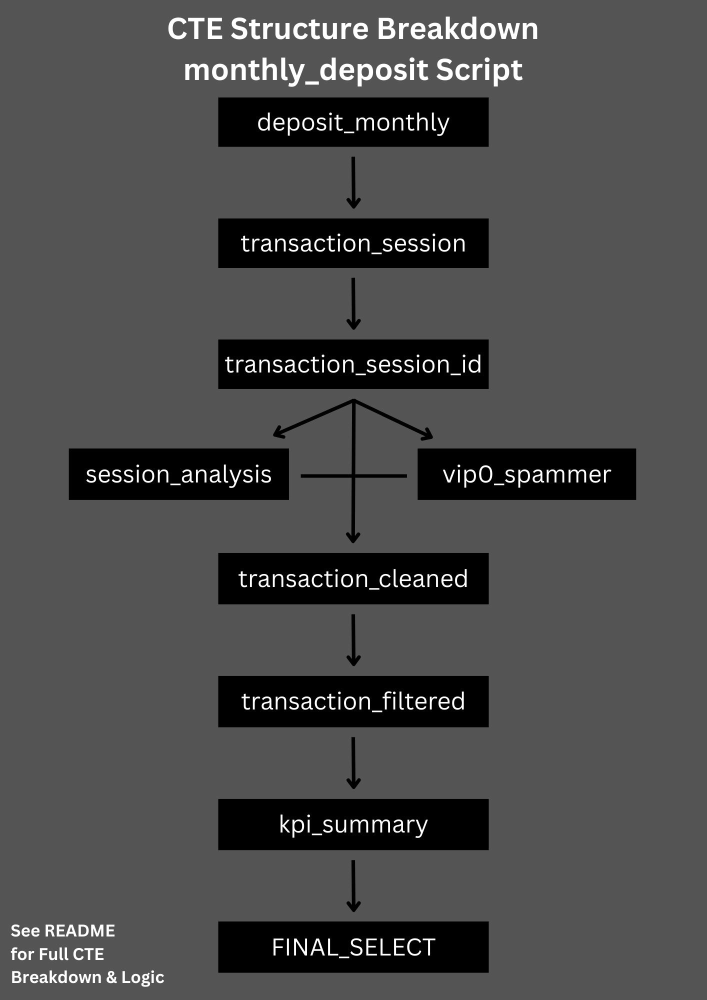

# SQL Scripts Summary

This folder contains 3 SQL scripts used in the dashboard:

1. **monthly_deposit_kpi.sql**  
   Performs full transformation and success rate calculation for deposit transactions.  
   *(Scroll down to see full breakdown of the CTE structure.)*

2. **monthly_withdrawal_kpi.sql**  
   Calculates monthly median withdrawal speed and total withdrawal volume per third-party channel.

3. **monthly_new_user_deposit.sql**  
   Counts unique new users making their first successful deposit per month.

---

### CTE Structure Breakdown (for `monthly_deposit_kpi.sql`)

The diagram below visualizes the step-by-step transformation process used in the deposit KPI script:

---

## CTE Breakdown

### 📌 `deposit_monthly`  
**Purpose**: Import deposit transaction data scoped to a specific month.  
**What it does**:
- Joins raw table `online_recharge_2025_xx` with `online_recharge_third_party`
- Categorizes each third-party as *Small*, *Medium*, *Large*, or *All Transaction Sizes*
- Filters rows based on the target month
- Adds `prev_order_time` using `LAG()` over `uid` to enable session tracking

### 📌 `transaction_session`  
**Purpose**: Identify deposit sessions for each user.  
**What it does**:
- Compares `order_time` with `prev_order_time` per user
- Flags a new session if time gap > 3 minutes
- Adds a `new_session` column (1 = new session, 0 = same session)

### 📌 `transaction_session_id`  
**Purpose**: Assign a running session ID per user.  
**What it does**:
- Uses `SUM(new_session)` over `uid` to generate `session_id`

### 📌 `session_analysis`  
**Purpose**: Summarize each user session.  
**What it does**:
- Calculates:
  1. `total_transaction`: Number of deposit attempts per session  
  2. `paid_count`: Number of successful (Paid) transactions per session
- Groups by `uid` and `session_id`

### 📌 `vip0_spammer`  
**Purpose**: Identify spam users from VIP 0 (new users).  
**What it does**:
- Filters users from `transaction_session_id` where:
  1. `vip_level = 0`  
  2. ≥ 5 total transactions  
  3. 0 successful Paid transactions
- Returns list of `uid` to exclude

### 📌 `transaction_cleaned`  
**Purpose**: Tag each transaction as valid or invalid.  
**What it does**:
- Joins session summary and spam list to the base table
- Adds `keep_transaction` column:
  - ❌ Exclude if `uid` is in spam list  
  - ❌ Exclude if session has ≥ 3 transactions but 0 Paid  
  - ✅ Keep if Paid or passes all filters

### 📌 `transaction_filtered`  
**Purpose**: Final dataset for KPI calculation.  
**What it does**:
- Filters only `keep_transaction = TRUE`

### 📌 `kpi_summary`  
**Purpose**: Aggregate KPI metrics by third-party.  
**What it does**:
- Groups by `third_party`, `category`, and `month`
- Calculates:
  1. `total_order_number`  
  2. `total_success_within_72h`  
  3. `total_deposit_amount`

### 📌 FINAL SELECT  
**Purpose**: Output final KPI result.  
**What it does**:
- Calculates `success_rate = total_success_within_72h / total_order_number`
- Sorts by `total_deposit_amount` in descending order
